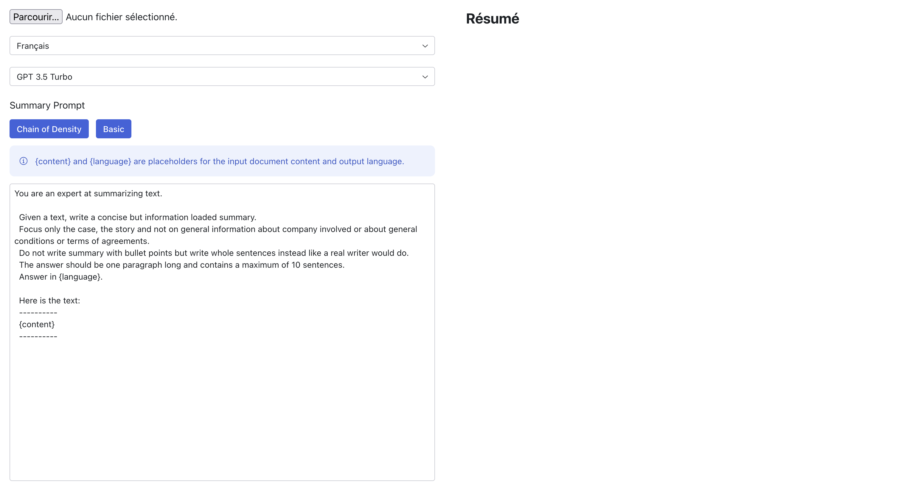

## POC document summary

Summarize PDF documents.



## Running in development

You need to set the following env variable in `.env` file

```
MISTRAL_KEY=
OPENAI_KEY=
```

Then generate an app key
```
node ace generate:key
```

Finally 
```
pnpm install
pnpm run dev
```
